# 이찬희 전체 프로젝트와 결과물 정리

작성 기준: 2026-07-03
범위: GitHub public/private 레포, Vercel 배포, Cloudflare Worker, Slack Bot, 로컬 Codex 산출물
주의: 이 문서는 공개 프로필용입니다. private 레포의 내부 URL, 토큰, 웹훅, 로컬 경로는 노출하지 않습니다.

## 1. 전체 요약

실제 포트폴리오 페이지: [chanhee-portfolio.vercel.app](https://chanhee-portfolio.vercel.app)

| 구분 | 규모 |
|---|---:|
| GitHub 레포 | 51개: public 21개, private 30개 |
| Archived 레포 | 11개 |
| Vercel 배포 | 20개 |
| Cloudflare Worker 자동화 | 2개 |
| Slack Bot/CLI 자동화 | 1개 |
| 주요 제작 방식 | Claude Code, Codex 기반 기획·구현·검증·배포 |

핵심 포지셔닝은 다음과 같습니다.

> 금융 리서치와 데이터 인프라를 AI 에이전트, 자동화, 제품형 UI로 구현하는 1인 빌더 포트폴리오입니다.

## 2. 전체 구조

```mermaid
flowchart TD
  A["이찬희 포트폴리오"] --> B["금융 AI / 리서치 인프라"]
  A --> C["CUFA / 투자 리서치"]
  A --> D["커리어 인텔리전스"]
  A --> E["제품형 웹앱 / 지식 플랫폼"]
  A --> F["운영 자동화 / Slack Bot"]
  A --> G["게임 / 실험 / 학습"]
  A --> H["기획 / 발표 / 문서 산출물"]

  B --> B1["NEXUS Finance MCP"]
  B --> B2["NEXUS Valuation Terminal"]
  B --> B3["Luxon Vault"]
  B --> B4["Luxon Research OS"]

  C --> C1["CUFA-WEB"]
  C --> C2["CUFA Wiki / Margin"]
  C --> C3["CUFA Equity Report"]
  C --> C4["Equity Research Book"]

  D --> D1["Career OS"]
  D --> D2["career-ops-kr"]
  D --> D3["커리어 대시보드"]

  E --> E1["AuctionPilot Madangi"]
  E --> E2["Surinjae Booking"]
  E --> E3["Mythology Atlas"]
  E --> E4["SceneDex"]

  F --> F1["lunch-menu-agent"]
  F --> F2["서울숲 날씨 봇"]
  F --> F3["KDA 특강 노트 봇"]
```

## 3. 핵심 대표 프로젝트

### 3.1 NEXUS Finance MCP

| 항목 | 내용 |
|---|---|
| 왜 만들었나 | 금융 데이터, 공시, 매크로, 퀀트, 대체데이터가 여러 API와 스크립트에 흩어져 있어 AI 에이전트가 안정적으로 호출하기 어려웠기 때문입니다. |
| 대상 | 본인 리서치, CUFA 리서치, 향후 NEXUS/FUND Stack 에이전트 |
| 포지셔닝 | 에이전트용 금융 인텔리전스 게이트웨이 |
| 설계 | profile-loadable server, tool registry, progressive discovery, controlled exposure |
| 기술 | Python, MCP/FastMCP, 금융 API, 도구 레지스트리 |
| 결과 | 수백 개 금융/데이터 도구를 묶은 private 핵심 인프라 |

### 3.2 NEXUS Valuation Terminal / Personal FAST Graphs

| 항목 | 내용 |
|---|---|
| 왜 만들었나 | 한국 주식 분석에서 LLM이 숫자를 생성하지 않고, 공시/API/CSV 기반으로 검증 가능한 밸류에이션을 만들기 위해서입니다. |
| 대상 | 한국 주식 투자자, CUFA 리서치, 가치투자 학습자 |
| 포지셔닝 | 출처 기반 주식 펀더멘털 밸류에이션 터미널 |
| 설계 | OpenDART, pykrx, marcap, consensus CSV, source trace, quality flag, deterministic formula |
| 기술 | Next.js, TypeScript, Python, 금융 데이터 파이프라인 |
| 결과 | [personal-fastgraphs.vercel.app](https://personal-fastgraphs.vercel.app) |

### 3.3 CUFA Research Stack

| 항목 | 내용 |
|---|---|
| 왜 만들었나 | CUFA 학회 운영, 금융 교육, 기업분석보고서 작성, 리서치 아카이브를 하나의 체계로 만들기 위해서입니다. |
| 대상 | CUFA 구성원, 충북대 학생, 금융권 취업 준비생, 투자 리서치 입문자 |
| 포지셔닝 | 학생 주도 금융 리서치 운영체계 |
| 구성 | CUFA-WEB, CUFA Wiki, Margin, CUFA Equity Report, Equity Research Book |
| 기술 | Next.js, TypeScript, MDX, Python, Markdown/DOCX |
| 결과 | 학회 웹사이트, 금융 위키, 기업분석 프로토콜, 약 24만 자 실전 기업분석 교재 |

### 3.4 Career OS / 커리어 인텔리전스

| 항목 | 내용 |
|---|---|
| 왜 만들었나 | 금융권 취업 전략을 감이 아니라 채용 데이터, 합격자 스펙, 산업 시나리오, 현실적 진입 경로로 판단하기 위해서입니다. |
| 대상 | 본인, 금융권·부동산금융·핀테크·공공 취업 준비생 |
| 포지셔닝 | 개인 커리어 전략 운영체계 |
| 설계 | hiring corpus, KOFIA census, 5-lane strategy, core 200 + directory 400 |
| 기술 | Python, CSV/JSON, React/Vite, TypeScript, Vercel |
| 결과 | [career-intelligence-v2](https://career-intelligence-v2-ashy.vercel.app), [finance/real asset dashboard](https://vercel-dashboard-weld-ten.vercel.app) |

### 3.5 Slack 운영 자동화

| 항목 | 내용 |
|---|---|
| 왜 만들었나 | KDA 활동과 서울숲 현장 운영에서 반복되는 식단, 날씨, 특강자료 공유를 자동화하기 위해서입니다. |
| 대상 | KDA 4기, 서울숲 활동자, Slack 채널 운영자 |
| 포지셔닝 | 실제 커뮤니티 운영 자동화 |
| 구성 | 밥플러스 알리미, 서울숲 날씨 알리미, KDA 특강 노트 봇 |
| 기술 | Cloudflare Worker, TypeScript, Node CLI, Slack API, Open-Meteo, Met Norway, Kakao Channel |
| 결과 | 실제 Slack 채널에 배포·테스트된 운영 봇 |

## 4. 전체 프로젝트 인벤토리

### A. 금융 AI / 리서치 인프라

| 프로젝트 | 공개 상태 | 핵심 역할 |
|---|---|---|
| `nexus-finance-mcp` | Private | 한국 금융, 글로벌 시장, 퀀트, 대체데이터, 리서치 워크플로우를 묶은 MCP 게이트웨이 |
| `luxon-ai` | Private, Archived | HERMES/NEXUS/DOGE 에이전트 기반 AI-native 금융 분석 시스템 |
| `personal-fastgraphs` | Private source / Public deploy | 한국 Top10 기업 중심 source-audited 밸류에이션 터미널 |
| `luxon-vault` | Private | Obsidian 기반 금융·퀀트·인프라 지식 저장소 |
| `luxon-research-os` | Private | paper-only 투자 리서치 운영체계 |
| `luxon-trading-lab` | Private | KIS Open API, 전략 빌더, 백테스터 보존 실험 |
| `luxon-terminal` | Public fork | AI quant backtester, KIS API, 리스크 엔진, 거래 실행 실험 |
| `luxon-sangkwon-mcp` | Public | 250만 점포 데이터 기반 한국 상권 인텔리전스 MCP 서버 |
| `luxon-guide-mcp` | Private, Archived | AI 현장 탐색 가이드 MCP |
| `local-code-agent-router` | Private | Windows 로컬 LLM 라우터와 local-ops 자동화 |
| `claude-assets` | Private | 로컬 Claude 자산을 재사용 가능한 에이전트 자산으로 정리 |
| `luxon-context` | Private, Archived | Luxon AI 정체성·운영·생존 컨텍스트 문서화 |

### B. CUFA / 투자 리서치 / 금융교육

| 프로젝트 | 공개 상태 | 핵심 역할 |
|---|---|---|
| `CUFA-WEB` | Private source / Public deploy | 충북대학교 가치투자학회 공식 웹사이트 |
| `CUFA-wiki` | Private source / Public deploy | 금융회사 DB, 투자분석, 계산기, 커리어 가이드 위키 |
| `margin` | Private | CUFA Wiki v2 통폐합판, Next.js/MDX 기반 금융 위키 |
| `CUFA` | Private | CUFA NEXUS 투자 리서치 운영 시스템 |
| `cufa-equity-report` | Private | CUFA 기업분석보고서 생성 표준 프로토콜 |
| `equity-research-book` | Public | 한국 시장 실전 기업분석 교재 |
| `AI-WM-Brief` | Public, Archived | PB/WM 디지털 브리핑 자동화 MVP |
| `luxon-crypto-lab` | Public | 코인 Top10 월간 딥다이브 리서치 블로그 |
| `value-map-ai` | Public | 코스피 Top10 모바일 리서치 챗봇 |
| `KDA_test` | Public | OpenAI/Gemini/LangChain/API 실습 노트북 |

### C. 커리어 / 취업 인텔리전스

| 프로젝트 | 공개 상태 | 핵심 역할 |
|---|---|---|
| `career-research-private` | Private | 개인 커리어 전략, 채용 코퍼스, 포지셔닝 자료 저장소 |
| `career-ops-kr` | Private | 한국 금융/핀테크/블록체인 구직 자동화 파이프라인 |
| `career-intelligence-v2` | Public deploy/local | 로봇, 반도체, 금융, 공공, 지방공기업 비교 대시보드 |
| `vercel-dashboard` | Public deploy/local | 금융권·부동산 커리어 대시보드 v3 |
| `vercel-integrated-career` | Public deploy/local | 통합 커리어 인텔리전스 v1 |
| `low-gpa-finance-strategy-20260608` | Private | 낮은 GPA 조건에서 금융권 진입 전략 분석 |
| `careerhigh-scraper` | Private, Archived | 금융권 채용공고 자동 수집기 |
| `finance-acceptance-db-20260522` | Public deploy | 금융권 합격/채용 데이터베이스 계열 배포물 |

### D. 제품형 웹앱 / 지식 플랫폼

| 프로젝트 | 공개 상태 | 핵심 역할 |
|---|---|---|
| `edu-platform` | Public | 2022 개정 교육과정 기반 초3~고3 인터랙티브 교육 플랫폼 |
| `Sophia-Atlas` | Public | 1,019명 사상가와 8,500개+ 관계를 시각화한 지식 그래프 |
| `mythology-atlas` | Private source / Public deploy | 비교신화 위키, 신화 MBTI, 모티프·지역·출처 탐색 |
| `auctionpilot-madangi` | Private source / Public deploy | 경매 초보자를 위한 AI 입찰/위험진단 도우미 |
| `goyang-ansan-apt-dashboard` | Private source / Public deploy | 고양·안산 역세권 아파트 후보 카드형 분석 대시보드 |
| `surinjae-booking` | Private source / Public deploy | 수린재 예약·결제·관리자 운영 MVP |
| `scenedex` | Private | K-pop 영상 속 초 단위 모먼트 색인 팬 플랫폼 |
| `dex386-pokedex` | Private source / Public deploy | 전국 포켓몬 도감 정적 사이트 private 원형 |
| `pokemon-pokedex-web` | Public | 전국 포켓몬 도감 public 정적 프론트엔드 |
| `field-atlas` | Private source / Public deploy | 필드·산업·직무 탐색형 아틀라스 실험 |
| `cbnugold` | Public deploy | 충북대/금융권 맥락 웹 프로젝트 배포물 |
| `veridex` | Public deploy | 제품/데모 배포물, 소스 매핑 보강 필요 |
| `hwagok` | Public | Hwagok 프로젝트 reserved public repo |

### E. 운영 자동화 / Slack Bot

| 프로젝트 | 상태 | 핵심 역할 |
|---|---|---|
| `lunch-menu-agent` | Private / Cloudflare | 밥플러스서울숲점 카카오 채널 메뉴 이미지를 Slack으로 전송 |
| `seoulforest-weather-slack` | Local output / Cloudflare | 서울숲 언더스탠드 에비뉴 오늘·내일 날씨 Slack 브리핑 |
| `lecture-note-bot` | Local output / Node CLI | KDA 특강 마크다운 파일을 Slack 자유게시판에 게시 |

### F. 게임 / 실험 / 학습

| 프로젝트 | 공개 상태 | 핵심 역할 |
|---|---|---|
| `mouse-freeze-challenge` | Public | 마우스 제어와 정지 타이밍을 훈련하는 브라우저 게임 |
| `game_projects` | Public | 행맨, 로또, 업다운, 묵찌빠 등 Python 콘솔 게임 모음 |
| `market-survivor-v2` | Private | 시장/투자 서바이벌형 게임 실험 |
| `crownfall` | Private, Archived | Godot 4.6 기반 한국 판타지 그리드 CRPG 실험 |
| `geopulse-kiwoom-mvp` | Private | 모바일 금융 이슈 스토리 데모 앱 |
| `test` | Public | 빈 실험 레포 |

### G. 포트폴리오 / 블로그 / 허브 / 포크

| 프로젝트 | 공개 상태 | 핵심 역할 |
|---|---|---|
| `pollmap` | Public | GitHub 프로필 README와 포트폴리오 허브 |
| `pollmap.github.io` | Public | 개인 빌드로그 허브, GitHub Pages 루트 |
| `luxon-blog` | Public, Archived | Luxon AI 리서치 블로그 Astro 버전 |
| `luxon-hugo` | Public, Archived | Hugo 기반 개인 포트폴리오 실험 |
| `pollmap-next` | Public, Archived | Next.js 기반 포트폴리오/Devlog/리서치 채널 실험 |
| `awesome-mcp-servers` | Public fork, Archived | MCP 서버 큐레이션 포크 |
| `openclaude` | Public fork, Archived | 멀티모델 코딩 에이전트 CLI 포크 |

## 5. Vercel 배포 결과물

| 배포명 | 링크 | 연결 프로젝트 |
|---|---|---|
| `personal-fastgraphs` | [배포](https://personal-fastgraphs.vercel.app) | NEXUS Valuation Terminal |
| `career-intelligence-v2` | [배포](https://career-intelligence-v2-ashy.vercel.app) | Career Intelligence v2 |
| `vercel-integrated-career` | [배포](https://vercel-integrated-career.vercel.app) | Career Intelligence v1 |
| `vercel-dashboard` | [배포](https://vercel-dashboard-weld-ten.vercel.app) | 금융권/부동산 커리어 대시보드 |
| `new-chat` | [배포](https://new-chat-iota-three.vercel.app) | 고양·안산 아파트 대시보드 |
| `value-map-ai` | [배포](https://value-map-ai.vercel.app) | 키우DA |
| `web` | [배포](https://web-opal-chi-74.vercel.app) | AuctionPilot 마당이 |
| `mouse-freeze-challenge` | [배포](https://mouse-freeze-challenge.vercel.app) | Mouse Freeze Challenge |
| `pokemon-pokedex` | [배포](https://pokemon-pokedex-seven.vercel.app) | Dex386 Pokedex |
| `veridex` | [배포](https://veridex-delta.vercel.app) | 소스 매핑 보강 필요 |
| `cufa-wiki` | [배포](https://cufa-wiki.vercel.app) | CUFA Wiki |
| `pokemon-pokedex-web` | [배포](https://pokemon-pokedex-web-mangos-projects-befba726.vercel.app) | Pokemon Pokedex public |
| `mythology-atlas` | [배포](https://mythology-atlas-eight.vercel.app) | Comparative Myth Wiki |
| `cbnugold` | [배포](https://cbnugold.vercel.app) | 소스 매핑 보강 필요 |
| `field-atlas` | [배포](https://field-atlas-pied.vercel.app) | Field Atlas |
| `edu-platform` | [배포](https://edu-platform-pi-two.vercel.app) | Edu Platform |
| `sophia-atlas` | [배포](https://sophia-atlas.vercel.app) | Sophia Atlas |
| `finance-acceptance-db-20260522` | [배포](https://finance-acceptance-db-20260522.vercel.app) | 금융권 합격/채용 DB |
| `cufa-web` | [배포](https://cufa-web-mangos-projects-befba726.vercel.app) | CUFA 공식 웹사이트 |
| `pollmap-surinjae-booking` | [배포](https://pollmap-surinjae-booking-mangos-projects-befba726.vercel.app) | Surinjae Booking |

## 6. 로컬 문서 / 발표 / PM 산출물

| 산출물 | 내용 | 상태 |
|---|---|---|
| UI/UX 로컬라이제이션 사례 후보풀 | 당근, Karrot, NAVER, Google Maps, Apple Pay, Kakao T 등 사례 분석 | Markdown + 슬라이드 이미지 |
| 국립중앙박물관 앱 개선 전략 | 유료 전환기 대응 통합 관람 플래너 전략, 1-pager, Mermaid 도식 | Markdown |
| 법등 PM 패키지 | 경전 기반 마음공부 루틴 앱의 시장·제품·MVP·AI 원칙 정리 | Markdown |
| 하루비움 | 마음정리 앱 PRD, Expo 앱, QA 이미지 | Expo + 문서 + 이미지 |
| 보안 점검/하드닝 | Windows 보안 감사, 방화벽 백업, 관리자 실행 로그 | Markdown + script |
| KDA 특강 노트 | 1~7번 특강 마크다운 정리와 Slack 게시 자동화 | Markdown + Slack Bot |
| 부동산 후보 분석 | 고양·안산 아파트 후보, CSV/JSON, 카드형 대시보드 | 데이터 + 웹앱 |

## 7. 공개 포트폴리오 우선순위

### Tier 1

| 프로젝트 | 이유 |
|---|---|
| NEXUS Finance MCP | 금융 데이터, AI 에이전트, 인프라 역량이 가장 선명합니다. |
| NEXUS Valuation Terminal | 실제 투자분석 제품으로 보이며 제품화 가능성이 큽니다. |
| CUFA-WEB / CUFA Wiki | 리더십, 커뮤니티 운영, 교육 콘텐츠, 실사용 맥락이 있습니다. |
| CUFA Equity Report / Equity Research Book | 금융권 취업/창업 포트폴리오에서 신뢰도가 높습니다. |
| Career OS / Career Dashboard | 데이터 기반 자기 전략 수립 능력을 보여줍니다. |
| Slack 자동화 3종 | 실제 사용되는 운영 자동화라 설득력이 큽니다. |

### Tier 2

| 프로젝트 | 이유 |
|---|---|
| Edu Platform | 대규모 콘텐츠 구조화와 교육 제품 역량을 보여줍니다. |
| Sophia Atlas | 지식 그래프와 디지털 인문학 역량을 보여줍니다. |
| Mythology Atlas | 다국어 콘텐츠와 게임형 진입 설계가 좋습니다. |
| AuctionPilot Madangi | 금융/부동산/AI 제품 기획 역량을 보여줍니다. |
| Surinjae Booking | 예약/결제/관리자 운영 흐름이 있는 실서비스형 앱입니다. |

### Tier 3

| 프로젝트 | 이유 |
|---|---|
| Mouse Freeze Challenge | 빠른 게임 제작 능력을 보여주는 가벼운 샘플입니다. |
| Pokemon Pokedex | 정적 대량 페이지와 데이터 처리 샘플입니다. |
| Market Survivor / Crownfall | 게임 실험으로 보존합니다. |
| OpenClaude / Awesome MCP fork | 학습/참고 포크로 낮은 가중치가 적합합니다. |

## 8. 추천 GitHub Pin

현재 공개적으로 가장 설득력 있는 pin 순서는 다음과 같습니다.

1. `value-map-ai`
2. `equity-research-book`
3. `luxon-sangkwon-mcp`
4. `luxon-crypto-lab`
5. `edu-platform`
6. `Sophia-Atlas`

private 핵심 프로젝트인 NEXUS Finance MCP, CUFA Equity Report, Career OS, Personal FAST Graphs는 설명에는 포함하되, public pin에는 직접 올리지 않는 편이 좋습니다.

## 9. 한 문장 요약

저는 충북대학교 경영학부 24학번이자 CUFA 2대 회장으로, 금융 리서치와 AI 에이전트 인프라를 결합해 NEXUS Finance MCP, CUFA 리서치 운영체계, source-backed 밸류에이션 터미널, Slack 운영 자동화, 교육/커리어 데이터 대시보드를 직접 기획하고 구현해왔습니다.
