# Chan-hee Lee Project Portfolio

Updated: 2026-07-03  
Scope: GitHub public/private inventory, Vercel deployments, local Codex outputs, and Cloudflare/Slack automations  
Public note: private source repositories are described without private GitHub URLs.

## Summary

| Area | Count / Scope |
|---|---:|
| GitHub repositories | 51 total: 21 public, 30 private |
| Vercel deployments | 20 projects |
| Cloudflare Worker automations | 2 active workers |
| Slack bot / CLI automations | 1 bot tool |
| Main building style | Claude Code / Codex assisted planning, implementation, testing, and deployment |

My portfolio is best understood as one connected system:

> financial research + data infrastructure + agentic automation + product interfaces.

## Portfolio Architecture

```mermaid
flowchart TD
  A["Chan-hee Lee Portfolio"] --> B["Financial AI Infrastructure"]
  A --> C["Investment Research / CUFA"]
  A --> D["Career Intelligence"]
  A --> E["Product MVPs"]
  A --> F["Operations Automation"]
  A --> G["Education / Knowledge Platforms"]

  B --> B1["NEXUS Finance MCP"]
  B --> B2["NEXUS Valuation Terminal"]
  B --> B3["Luxon Vault"]
  B --> B4["Luxon Research OS"]

  C --> C1["CUFA-WEB"]
  C --> C2["CUFA Wiki / Margin"]
  C --> C3["CUFA Equity Report"]
  C --> C4["Equity Research Book"]

  D --> D1["Career OS"]
  D --> D2["career-ops-kr"]
  D --> D3["Career Intelligence Dashboards"]

  E --> E1["AuctionPilot Madangi"]
  E --> E2["Surinjae Booking"]
  E --> E3["Mythology Atlas"]
  E --> E4["SceneDex"]

  F --> F1["lunch-menu-agent"]
  F --> F2["Seoul Forest Weather Bot"]
  F --> F3["KDA Lecture Note Bot"]
```

## 1. Financial AI Infrastructure

### NEXUS Finance MCP

| Item | Detail |
|---|---|
| Why | Financial data, disclosures, macro data, quant research, and alternative data were fragmented across different APIs and local scripts. I needed a profile-aware gateway that AI agents could use safely. |
| Target User | Personal research workflow, CUFA research, future NEXUS/FUND Stack agents |
| Positioning | Agent-facing financial intelligence gateway |
| Design | Profile-loadable servers, progressive tool discovery, `search_tools`, `tool_info`, and controlled tool exposure |
| Stack | Python, MCP/FastMCP, financial APIs, registry-based tool design |
| Result | Private infrastructure with hundreds of finance/data tools and workflow surfaces |

### NEXUS Valuation Terminal / Personal FAST Graphs

| Item | Detail |
|---|---|
| Why | I wanted a Korean stock valuation terminal that uses source-backed financial data instead of LLM-generated numbers. |
| Target User | Korean equity researchers, CUFA members, value investors |
| Positioning | Source-audited fundamental valuation terminal |
| Design | OpenDART, pykrx, marcap, consensus CSV, source trace, deterministic formula, quality flags |
| Stack | Next.js, TypeScript, Python, financial data pipelines |
| Result | [personal-fastgraphs.vercel.app](https://personal-fastgraphs.vercel.app) |

### Luxon Vault

| Item | Detail |
|---|---|
| Why | Long-term research notes, market data, papers, and project outputs needed one reusable knowledge base. |
| Target User | Personal research OS and AI memory layer |
| Positioning | Obsidian-based AI shared brain |
| Design | Raw, wiki, inbox, projects, memory, outputs, archive, system |
| Stack | Obsidian, Markdown, Python automation |
| Result | Private vault with compiled wiki notes, cross-linking, and quality control loops |

### Luxon Research OS

| Item | Detail |
|---|---|
| Why | Investment research needed a paper-only operating system before any real-capital workflow. |
| Target User | Personal research workflow |
| Positioning | Private control plane for source-backed investment research |
| Design | GitHub estate indexing, SQLite FTS, Obsidian command inbox, scheduled research jobs |
| Stack | Python, SQLite, Markdown, GitHub, local automation |
| Result | Private research operating system |

## 2. Investment Research / CUFA

### CUFA-WEB

| Item | Detail |
|---|---|
| Why | CUFA needed an official web presence for recruiting, research archiving, and credibility. |
| Target User | CBNU students, CUFA applicants, members, external partners |
| Positioning | Official website for Chungbuk National University Finance Association |
| Stack | Next.js, TypeScript, Tailwind CSS |
| Result | [cufa-web.vercel.app](https://cufa-web.vercel.app/) |

### CUFA Wiki / Margin

| Item | Detail |
|---|---|
| Why | Finance students needed a Korean reference hub for company databases, investment analysis, industry value chains, and career preparation. |
| Target User | CUFA members, finance job seekers, investment research beginners |
| Positioning | Korean finance wiki and learning system |
| Stack | Docusaurus, Next.js, MDX, Tailwind, Recharts |
| Result | [cufa-wiki.vercel.app](https://cufa-wiki.vercel.app/) and private v2 consolidation |

### CUFA Equity Report

| Item | Detail |
|---|---|
| Why | Equity reports needed a repeatable standard instead of one-off writing. |
| Target User | CUFA research team and Korean equity research learners |
| Positioning | Standard protocol for source-backed company reports |
| Design | Phase 0 preflight, build, evaluator, re-rating note, anti-hallucination controls |
| Stack | Python, Markdown/DOCX, evaluator scripts, Nexus MCP integration design |
| Result | Private report-generation standard for reusable company analysis |

### Equity Research Book

| Item | Detail |
|---|---|
| Why | I wanted to turn practical Korean market company analysis into an 8-week learning system. |
| Target User | Finance students, RA candidates, value investing learners |
| Positioning | Practical Korean equity research curriculum |
| Stack | Markdown/DOCX, structured curriculum, examples, appendix system |
| Result | [equity-research-book](https://github.com/pollmap/equity-research-book), about 240K Korean characters |

### Value Map AI / 키우DA

| Item | Detail |
|---|---|
| Why | Stock education tools often stop at price or company summaries. I wanted a conversation flow that connects company cards, financials, value chain, and ETF exposure. |
| Target User | Beginner to intermediate Korean stock learners |
| Positioning | Mobile research chatbot for KOSPI Top 10 companies |
| Stack | JavaScript, HTML, CSS, Vercel |
| Result | [value-map-ai.vercel.app](https://value-map-ai.vercel.app) |

### Luxon Crypto Lab

| Item | Detail |
|---|---|
| Why | Digital assets should be analyzed through macro cycle, on-chain data, tokenomics, and risk, not only price narratives. |
| Target User | Korean crypto researchers and investors |
| Positioning | Monthly deep-dive crypto research platform |
| Stack | MDX, TypeScript, React, Tailwind, GitHub Pages/Vercel |
| Result | [luxon-crypto-lab.vercel.app](https://luxon-crypto-lab.vercel.app) |

## 3. Career Intelligence

### Career OS

| Item | Detail |
|---|---|
| Why | My finance career strategy needed to be based on evidence, hiring data, company lanes, and realistic entry paths. |
| Target User | Myself first, then finance job seekers |
| Positioning | Personal career intelligence operating system |
| Design | Hiring corpus, source-backed scan notes, 5-lane strategy, charts, proof packets |
| Stack | Python, CSV, Markdown, charts, private repository |
| Result | Private career research repository and dashboard outputs |

### career-ops-kr

| Item | Detail |
|---|---|
| Why | Korean finance, fintech, and blockchain job opportunities needed automated collection and strict authenticity checks. |
| Target User | Finance job seekers and research automation users |
| Positioning | Korean finance career data pipeline |
| Stack | Python, CLI, registry, provenance gate, deduplication, quarantine |
| Result | Private job market data pipeline |

### Career Intelligence Dashboards

| Dashboard | Link | Scope |
|---|---|---|
| Career Intelligence v2 | [Live](https://career-intelligence-v2-ashy.vercel.app) | Robotics, semiconductor, finance, public sector, and local government options |
| Integrated Career v1 | [Live](https://vercel-integrated-career.vercel.app) | Static integrated career dashboard |
| Finance / Real Asset Career Dashboard | [Live](https://vercel-dashboard-weld-ten.vercel.app) | Finance and real asset company universe |

## 4. Product MVPs

### AuctionPilot Madangi

| Item | Detail |
|---|---|
| Why | Auction beginners struggle with rights, occupancy, price, documents, and comparable cases. |
| Target User | Real estate auction beginners |
| Positioning | AI auction bidding and risk-reading assistant |
| Stack | Next.js, Python, Figma, Vercel |
| Result | [web-opal-chi-74.vercel.app](https://web-opal-chi-74.vercel.app) |

### Goyang / Ansan Apartment Dashboard

| Item | Detail |
|---|---|
| Why | Apartment candidates should be compared by price, area, station access, evidence, and scenarios instead of raw listings. |
| Target User | Real users and investors comparing Goyang/Ansan apartments |
| Positioning | Card-based real estate candidate dashboard |
| Stack | React, Vite, TypeScript, Python data processing |
| Result | [new-chat-iota-three.vercel.app](https://new-chat-iota-three.vercel.app) |

### Surinjae Booking

| Item | Detail |
|---|---|
| Why | A small booking business needs reservation, payment, webhook sync, and admin controls in one MVP. |
| Target User | Small venue operators and non-member customers |
| Positioning | Reservation/payment/admin MVP |
| Stack | Next.js App Router, TypeScript, payments/webhooks design |
| Result | [pollmap-surinjae-booking](https://pollmap-surinjae-booking-mangos-projects-befba726.vercel.app) |

### SceneDex

| Item | Detail |
|---|---|
| Why | K-pop fans need second-level indexing for moments, choreography, expressions, memes, and timestamps. |
| Target User | K-pop fandom users |
| Positioning | Fan-curated video moment discovery layer |
| Stack | Python, FastAPI-style backend, HTML/CSS/JS, YouTube-oriented data model |
| Result | Private source, productization notes |

## 5. Education / Knowledge Platforms

| Project | Description | Link |
|---|---|---|
| Edu Platform | Korean curriculum-based interactive learning platform for elementary to high school subjects | [Live](https://edu-platform-pi-two.vercel.app) |
| Sophia Atlas | Interactive platform for philosophers, religions, science, culture, and intellectual history | [Live](https://sophia-atlas.vercel.app) |
| Mythology Atlas | Korean-first bilingual comparative mythology wiki with motif, region, source, and archetype flows | [Live](https://mythology-atlas-eight.vercel.app) |
| Pokemon Pokedex | Static frontend Pokedex with national index pages and filters | [Public repo](https://github.com/pollmap/pokemon-pokedex-web) |

## 6. Operations Automation

| Project | Why It Exists | Stack / Runtime |
|---|---|---|
| lunch-menu-agent | Sends the latest lunch menu image from a Kakao channel to Slack with duplicate prevention | Cloudflare Worker, KV, Slack API |
| Seoul Forest Weather Bot | Sends Seoul Forest / Under Stand Avenue weather briefings to Slack at fixed times | Cloudflare Worker, Open-Meteo, Met Norway, Slack |
| KDA Lecture Note Bot | Posts lecture note markdown files and original `.md` files to a KDA Slack channel | Node CLI, Slack Bot Token, file upload API |

These projects are small but important: they show actual operations automation for a real community instead of isolated demos.

## 7. Experiments / Learning Projects

| Project | Description | Link |
|---|---|---|
| Mouse Freeze Challenge | Browser game for mouse control and timing discipline | [Live](https://mouse-freeze-challenge.vercel.app) |
| game_projects | Python console games and file I/O exercises | [Repo](https://github.com/pollmap/game_projects) |
| market-survivor-v2 | Market/investing game prototype | Private |
| crownfall | Godot 4.6 Korean fantasy grid CRPG experiment | Private archived |
| local-code-agent-router | Windows local LLM router and operations automation | Private |

## 8. Public / Private Strategy

| Layer | Public Strategy |
|---|---|
| Public proof | Keep public repos and Vercel links polished, readable, and recruiter-friendly |
| Private infrastructure | Describe capability and architecture, but do not expose private repository URLs |
| Archived prototypes | Label as archived prototypes instead of hiding them |
| Automation bots | Show process and architecture, not secrets or channel credentials |
| Future direction | Consolidate flagship work around NEXUS, FUND Stack, CUFA Research Ops, and real operating automation |

## 9. Recommended Pinning

If GitHub pins are used, the strongest public-facing order is:

1. `value-map-ai`
2. `equity-research-book`
3. `luxon-sangkwon-mcp`
4. `luxon-crypto-lab`
5. `edu-platform`
6. `Sophia-Atlas`

Private flagship work such as NEXUS Finance MCP, CUFA Equity Report, Career OS, and Personal FAST Graphs should be referenced in the profile and portfolio, but kept out of public pinned source unless intentionally opened later.

